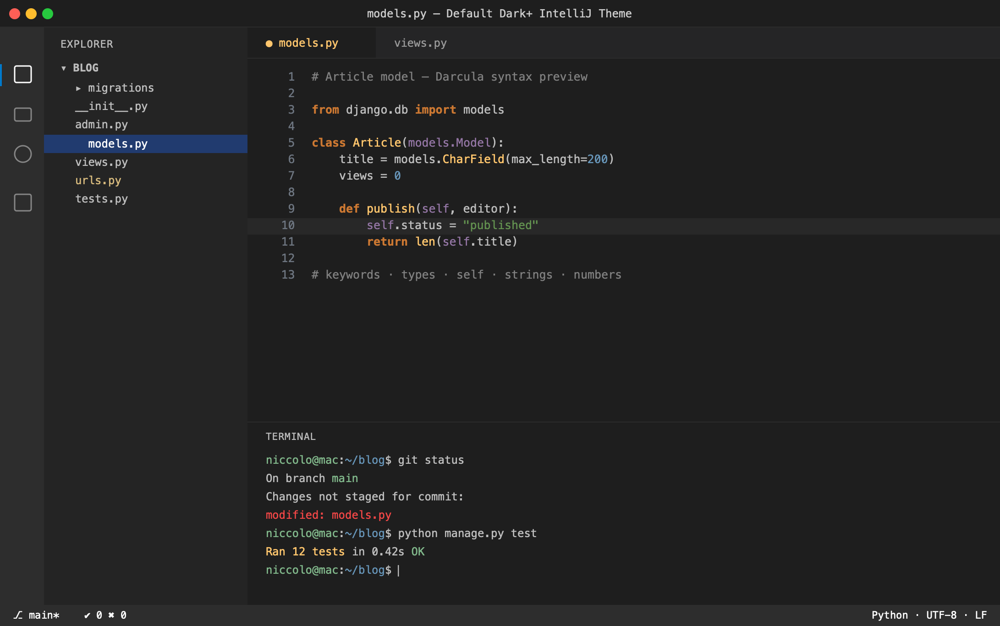

# Default Dark+ IntelliJ Theme (Visual Studio Code)

[](https://marketplace.visualstudio.com/items?itemName=niccolomineo.default-dark-plus-intellij)
[](https://marketplace.visualstudio.com/items?itemName=niccolomineo.default-dark-plus-intellij)
[](LICENSE)

A theme extension coupling the **Darcula** syntax color scheme (JetBrains' classic dark scheme, as shipped in IntelliJ IDEA) with an improved take on VSCode's Default Dark+ UI colors.



## Features

- **Darcula syntax colors** — the recognizable palette: orange bold keywords (`#CC7832`), teal types (`#4EC9B0`), amber functions (`#FFC66D`), purple variables (`#9476a5`), green strings and blue numbers.
- **Expanded workbench UI** — full coverage of title bar, tabs, lists, inputs, widgets, scrollbars, editor diagnostics, Git decorations and the 16 integrated-terminal ANSI colors, all harmonized with the Darcula palette rather than inheriting bare Dark+.

## Install

**From the Marketplace**

1. Open the Extensions view (`Ctrl+Shift+X` / `Cmd+Shift+X`).
2. Search for *Default Dark+ IntelliJ Theme* and click **Install**.
3. Run **Preferences: Color Theme** (`Ctrl+K Ctrl+T`) and pick *Default Dark+ IntelliJ Theme*.

**From a `.vsix`**

```sh
npm install
npm run package          # produces default-dark-plus-intellij-<version>.vsix
code --install-extension default-dark-plus-intellij-<version>.vsix
```

## Credits

The syntax colors are based on the **Darcula** color scheme by JetBrains. This extension is an independent project and is not affiliated with or endorsed by JetBrains.

## License

Released under the [MIT License](LICENSE).
